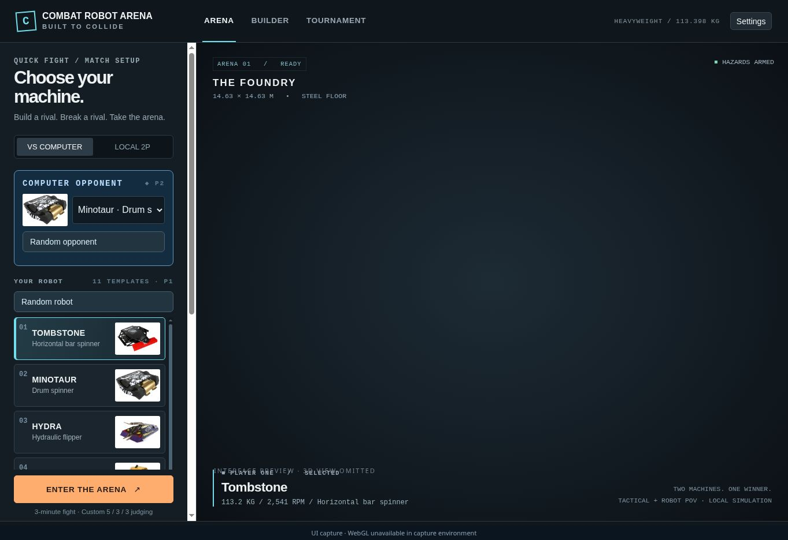
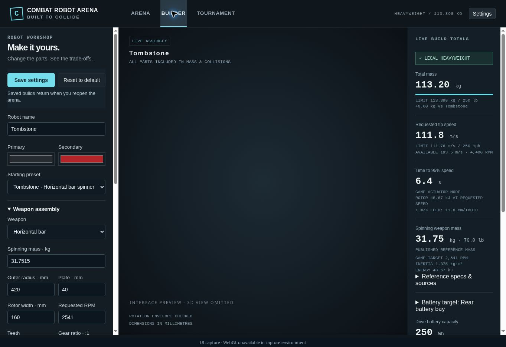
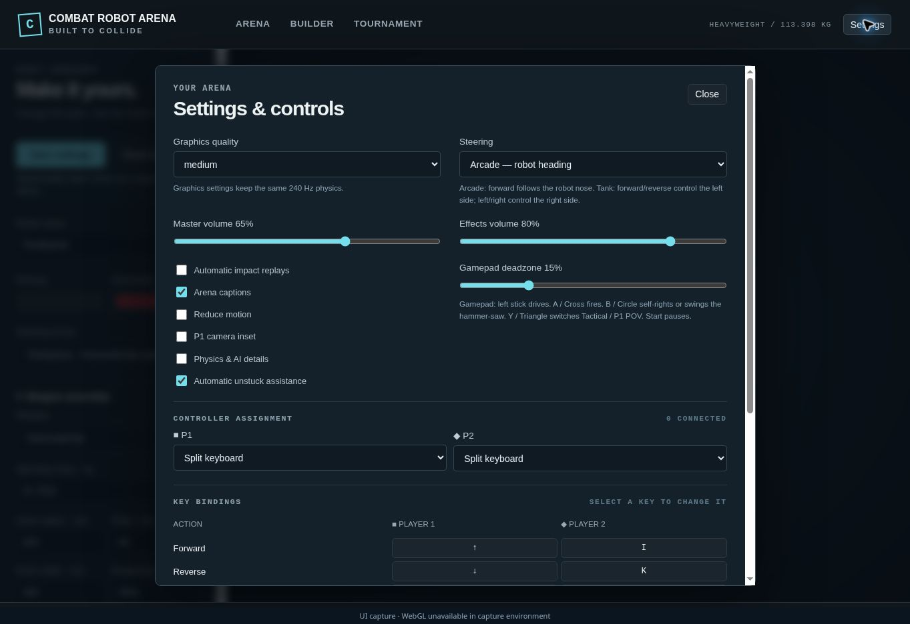

# 🤖 Combat Robot Arena

[](https://www.typescriptlang.org/) [](https://threejs.org/) [](https://rapier.rs/) [](https://vite.dev/)
[](https://www.khronos.org/webgl/) [](https://webassembly.org/) [](https://nodejs.org/) [](docs/ONLINE_PLAY.md)
[](https://redis.io/) [](https://upstash.com/) [](https://bbots-tjh87.vercel.app) [](https://github.com/tjh87/combat-robot-arena/actions)

**[Play the live arena](https://bbots-tjh87.vercel.app)** · [Online rooms and controls](docs/ONLINE_PLAY.md) · [Robot builder and saved library](docs/ROBOT_BUILDER.md) · [Final damage calculation](docs/DAMAGE_CALCULATION.md) · [Weapon instruments and effects](docs/WEAPON_EFFECTS.md)

**Build a machine. Pick a rival. Take the arena.**

A local 3D robot-combat game with 11 heavyweight machines, physics-driven weapons, a custom robot builder, AI opponents, local two-player battles and tournaments. Drive from the tactical camera or robot POV, use the arena hazards, watch damage and battery failures unfold, then replay the decisive hit.

🪟 **Windows x64 offline package** · 🛠️ **Complete editable source** · ⚔️ **11 stock robots**

## 🪟 Start here: what to install

For the **full Windows release ZIP**, you need Windows x64 and a browser with WebGL 2/hardware acceleration. **Node.js, npm, build dependencies and native Windows build tools are already included.** Extract the whole ZIP and double-click `START-WINDOWS.cmd`.

For a **source-only clone**, install Node.js 22.12+ and Git, then run `npm.cmd ci`, `npm.cmd run build` and `npm.cmd start` while online for the initial install.

For **Codex development**, install Codex separately and sign in. An editor is optional. Git/GitHub CLI are only needed for repository sync/publication; Python is only needed to regenerate the full ZIP.

➡️ **[Detailed Windows installation and setup](WINDOWS_SETUP.md)** — exact prerequisites, PowerShell commands, offline rules, Codex installation and troubleshooting.

Download **Combat_Robot_Arena_Windows_Offline_Codex.zip** from [Releases](https://github.com/tjh87/combat-robot-arena/releases). GitHub's automatic “Source code” downloads do not contain the bundled runtime or installed dependencies.

## 📸 Interface screenshots

These historical screenshots show the menu, builder and settings UI. The capture browser lacked WebGL, so the 3D renderer was omitted in a labeled UI preview. They do **not** show or certify live arena graphics. Game source and physics settings were preserved.

| Choose a robot | Tune your machine |
| --- | --- |
|  |  |



## ⚔️ What is in the game?

- **Physics-driven fights:** separate spinning weapons, articulated arms, hydraulic crushing, flippers, gyroscopic recovery, contact damage, fall damage and ring-outs.
- **A hazardous arena:** rising paired floor saws, 50 lb hammer heads, an upper deck and lifting screws that reverse when a robot jams.
- **Robot workshop:** chassis, armour, weapons, motors, batteries, wheels and caterpillar treads; all 11 part catalogues, scratch builds, independent assemblies, fit warnings, part statistics, a saved robot library and import/export codes.
- **Several ways to play:** Quick Fight, practice, three AI difficulties, local two-player control, four-digit online rooms, and eight-entry tournaments.
- **Readable action:** compact weapon gauges, Hydra Flip Assist, battery-location hints, speed in km/h and sharp animated damage bubbles with seven damage tiers.
- **Match presentation:** countdown, local audio, impact effects, replay/highlights, result statistics and small winner-only confetti.
- **Offline modes:** local assets, local saves, and embedded physics WASM. Online rooms use the hosted WebSocket service and Redis.

## 🦾 Stock roster

| Robot | Main weapon / character |
| --- | --- |
| Tombstone | Horizontal bar spinner |
| Minotaur | Drum spinner and gyroscopic self-righting |
| Hydra | Hydraulic flipper with Flip Assist |
| ICEwave | Overhead horizontal blade and engine audio |
| HyperShock | Four-wheel vertical disc spinner |
| Gigabyte | Full-body spinning shell with separate drive heading |
| Son of Whyachi | Horizontal cage rotor |
| HUGE | Large wheels, horizontal outer poles and central vertical blade |
| SawBlaze | Fast overhead hammer arm carrying an independent spinning saw |
| Deep Six | Large vertical bar spinner |
| Quantum | Hydraulic crushing jaw, battery penetration and short release retreat |

Each stock machine has 1,200 chassis HP. These are reference-inspired game models with custom rules. Weapon references, derived values and estimates are distinguished in the source. Battery coordinates are fitted game estimates, not certified hardware measurements.

## 🎮 Controls

| Action | Player 1 | Player 2 |
| --- | --- | --- |
| Drive | Arrow keys | I / J / K / L |
| Weapon | Space | Enter |
| Strike / self-right | Q | U |
| Camera | E | O |
| Manual Unstick | R | P |
| Pause | Escape | Escape |
| After the match | **R** rematch · **M** arena menu | Same result shortcuts |

Controls can be remapped. Manual Unstick is separate from physical self-righting. Click the game to enable audio.

## 🛠️ Continue building on Windows

Extract to a folder such as `C:\Games\combat-robot-arena`. Open PowerShell there:

```powershell
.\runtime\windows-x64\node.exe scripts\verify-manifest.mjs
.\DEVELOP-WINDOWS.cmd
```

Check the manifest before making edits. Stop development with Ctrl+C, then run:

```powershell
.\BUILD-WINDOWS.cmd
.\TEST-WINDOWS.cmd
.\START-WINDOWS.cmd
```

`TEST-WINDOWS.cmd --physics` adds core, battery and gyro checks. Play and development share port 4173; run one server at a time. The browser address is `http://127.0.0.1:4173/`. Keep the server window open.

**Do not run `npm ci` in the full offline ZIP.** Its dependencies are already installed. Source edits need a fresh build before they appear through START.

### 🧠 Ready-to-paste Codex prompts

Every prompt begins with **what to install and how to build/run on Windows**, then the task and its do/don't rules.

| Prompt | Use it for |
| --- | --- |
| [Continue development](handover/CODEX_CONTINUE_PROMPT.md) | Resume work on this existing project |
| [Complete build specification](handover/CODEX_BUILD_ALL_PROMPT.md) | Detailed full-game specification and implementation sequence |
| [Review and fix bugs](handover/CODEX_REVIEW_PROMPT.md) | Focused review, reproduction, repair and validation |
| [Feature template](handover/CODEX_FEATURE_PROMPT_TEMPLATE.md) | Add your next requested change |

The game and included build tools run offline. Codex and AI models are separate; hosted AI requires internet. The package does not promise disconnected Codex inference.

## Tournament presentation

The cup uses animated result paths, robot portraits, and current-cup win/loss records. The offline repair studio shows component choices and a live budget.

[Presentation and acceptance details](docs/TOURNAMENT_PRESENTATION.md)

## 📦 Package and source map

| Path | Contents |
| --- | --- |
| `src/` | TypeScript game, physics, rendering, builder and UI |
| `public/` | 11 robot photos, 12 local audio files and notices |
| `tests/` | Physics, geometry, UI and packaging checks |
| `handover/` | Prompts, current requirements, specifications, architecture and validation |
| `reference-images/` | Eight original user visual references |
| `docs/` | Historical research, reports and screenshots |
| `scripts/` | Local servers, build, verification and packaging helpers |
| `dist/`, `node_modules/`, `runtime/` | Generated game and portable tools, included in the release ZIP only |

Stack: **TypeScript · Three.js 0.180.0 · Rapier 0.19.0 · Vite 7.1.7**. Dependencies are locked. Physics uses SI units and a fixed 240 Hz timestep.

Start with [START_HERE](handover/START_HERE.md), [current requirements](handover/CURRENT_REQUIREMENTS.md), [architecture](handover/ARCHITECTURE.md), [do/don't rules](handover/DO_AND_DO_NOT.md) and [test plan](handover/TEST_PLAN.md). Current instructions and source take precedence over historical `docs/` reports.

## ✅ Validation and private publication

See [Windows package validation](handover/WINDOWS_PACKAGE_VALIDATION.json) for the checks run for this package. Windows native execution, real WebGL rendering, audible playback and a disconnected target-PC smoke check remain manual checks. A Linux build or binary-header inspection is not a Windows execution test.

The full ZIP includes SHA-256 checksums for its files. A separate `.sha256` file verifies the ZIP itself. To regenerate it after building and testing, install Python and run `py -3 scripts\package-offline.py --target windows`.

Keep source in this **private** repository and attach full offline ZIPs to its private releases. See [GitHub publication](handover/GITHUB_PUBLISH.md) and [third-party notices](handover/THIRD_PARTY_NOTICES.md). Robot names and images remain their respective owners' material; this repository does not grant new rights to those assets.
